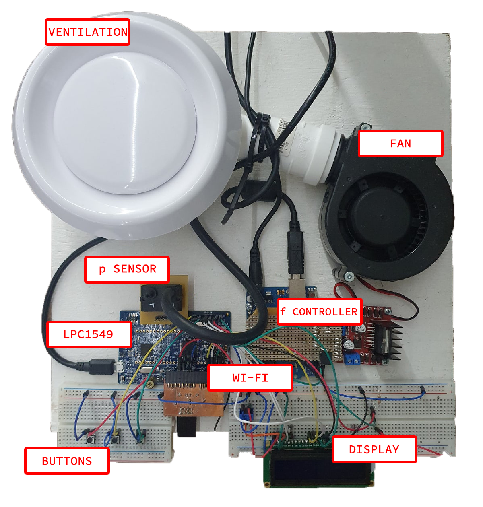

# Smart Ventilation Control

Created by Metropolia University of Applied Science students, 3rd yead, Smart IoT Systems major.

**NOTE:** Documentation about web part of the project is provided in the corresponding folder: [[CLICK](./web/README.md)] 
**NOTE:** Documentation about embedded part of the project is provided in the corresponding folder: [[CLICK](./embedded/README.md)]

# Overview

The project provides an end-to-end Internet of Things solution for controlling and monitorin pressure in the ventilation, using ABB Frequency Controller simulator. 
The idea is to provide two UIs - one hosted on local server (web UI) and one attached to device (Liquid Crystal Display). 
All user interfaces are syncronized and communicating with each other.

User has an ability to choose between **manual** and **automatic** modes. 
* In manual mode, user can control the frequency of the fan.
* In automatic mode, user can control the target pressure that should be achieved in the ventilation.

# Technology stack

### Web side

| Technology | Application |
|------------|-------------|
| anime.js   | Frontend    |
| tailwind   | Frontend    |
| NodeJS     | Backend     |
| MQTT       | Backend     |
| MongoDB    | Database    |

NodeJS modules in use: TBA

### Embedded side

Primary language for programming: **C++** 
Seconday language: **C** 
Use of non-standard libraries: C++ Json

More detailed hardware architecture is provided in separate documentation, as mentioned above.

## Overall project arcitecture

