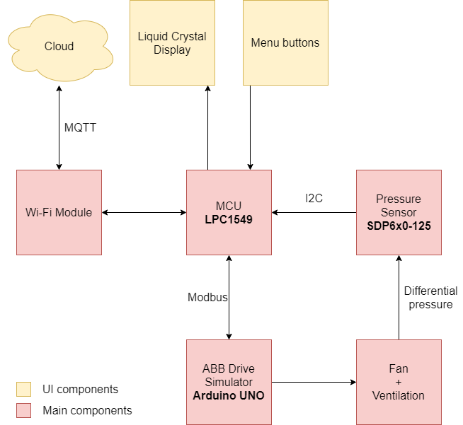

# ABB Vent Control: Embedded Architecture

Embedded Software is written for LPC1549 development board. 
Primary language is C++.

## Overview

Pictures and general description of the project is provided in root folder.

The system consists of several components:
* ABB Frequency Controller simulator (Arduino)
* Ventilation and servo, controlled by ABB drive.
* LiquidCrystal display
* Button module with 3 buttons
* Wi-Fi module 

The main idea is to provide two operation modes for the system: **automatic** and **manual**:
* In manual mode frequency is controlled by the user, other items must not be adjustable.
* In automatic mode system's target prussere is controlled by the user, other items must not be adjustable. 

The system expects input from WEB UI (via MQTT payload) and Button module. 
Considering several input and output methods, software needs to syncronize LCD, WEB UI with current machine's state.

## Hardware Architecture

The following diagram describes the hardware architecure, that includes the components described above, in the abstract form.

More detailed information is provided further in schematics.

### Schematics

Full HD link: [Schematics FULL HD](https://i.imgur.com/IRX7cOy.png)

## Software Architecture

Insert diagram here
