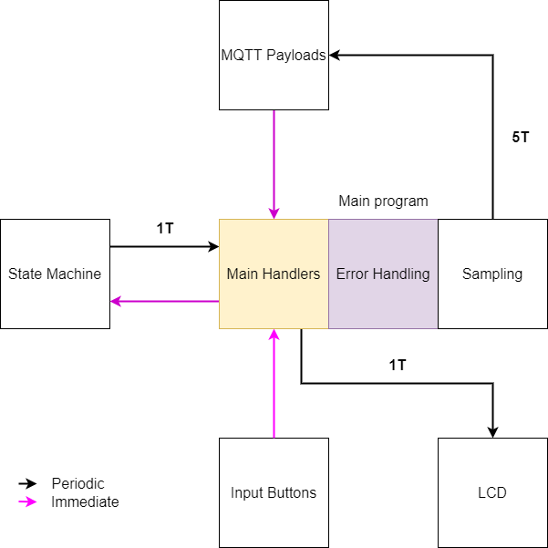
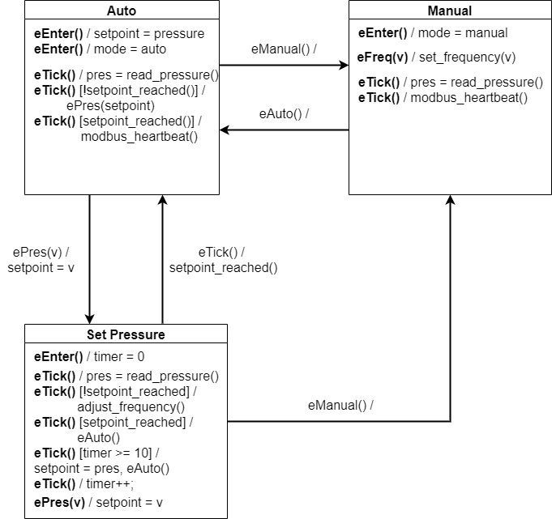

# ABB Vent Control: Embedded Architecture

Embedded Software is written for LPC1549 development board. 
Primary language is C++.

The project creates a smart system solution for adjusting and monitoring pressure in ventilation, using ABB frequency controller simulator.

# Overview

Pictures and general description of the project is provided in root folder.

The system consists of several components:
* ABB Frequency Controller simulator (Arduino)
* Ventilation and servo, controlled by ABB drive.
* LiquidCrystal display
* Button module with 3 buttons
* Wi-Fi module 

The main idea is to provide two operation modes for the system: **automatic** and **manual**:
* In manual mode frequency is controlled by the user, other items must not be adjustable.
* In automatic mode system's target prussere is controlled by the user, other items must not be adjustable. 

The system expects input from WEB UI (via MQTT payload) and Button module. 
Considering several input and output methods, software needs to syncronize LCD, WEB UI with current machine's state.

# Hardware Architecture

The following diagram describes the hardware architecure, that includes the components described above, in the abstract form.

More detailed information is provided further in schematics.

## Schematics

Full HD link: [Schematics FULL HD](https://i.imgur.com/IRX7cOy.png)

## Components used

MCU LPC1549: [MCU](https://www.nxp.com/docs/en/data-sheet/LPC15XX.pdf) 
LCD: Not specified, containg backlight 
WI-Fi module: Not specified, PCB provided by Metropolia UAS 
Pressure Sensor SDP6x0-125: [SDP](https://www.scribd.com/document/144110195/Sensirion-Differential-Pressure-SDP6x0) 
ABB Frequency Simulator: [ABB](https://library.e.abb.com/public/25ba8ab3f04e2266c12572e9004ffafe/EN_ACH550_EFB_D.pdf) 

# Software Architecture

Abstract software architecture is described in the figure below.

As we can see, the main components of the architecture are:
* State Machine
* MQTT payloads
* Menu button inputs
* Liquid Crystal Display output
* Main Program body

In addition to interaction described in a diagram, main program generate eTick event for state machine at 1T rate.

Colors on the diagram describe when interaction is happening. 
<b>Purple</b> - interaction happens immediately 
<b>Black</b> - interaction happens periodically (specified by label). 
1T = 1 Tick = 1000 ms.

Some of the complex concepts are described in details.

## State machine

State machine architecture is described in the UML, introduced in this section.

Member variables of state machine: 
Pressure, Setpoint, Frequency, Mode, Timer, Status, Pointer to ABB drive, Pointer to SDP pressure sensor

Statuses: 
0 - status **OK** 
1 - status **LOADING** (unused in current implementation) 
-1 - status **HARDWARE_FAILURE** 
-2 - status **TIMEOUT** (setpoint unreachable) 

The functions introduced in the UML are the member dunctions of state machine. 
Additionally, there should be a member function for exporting data and status (returning members).
* **read_pressure** - read from SDP
* **set_frequency(v)** - set frequency to v
* **adjust_frequency** - automatically adjust frequency for a specific step
* **modbus_heartbeat** - keep modbus connection awake  

 

The described is recommended and current implementation. Differences and improvements are possible.

## Main handlers

The idea behind main handlers is to have a "connector" that will keep WEB UI, LCD and State machine syncronized. 
In order to achieve this syncronization, handler functions are called with periodicity described in the software acrhitecture diagram. 
There are four handlers that follow the same pattern: 
pressure_handler, frequency_handler, setpoint_handler, mode_handler

General algorithms for handlers: 
**handler(value): **
1. If LCD_CURRENT != value, then update LCD
2. If STATE_MACHINE_CURRENT != value, then update STATE_MACHINE

## Usage of external libraries

One external library was used for JSON parsing. 
Credits: [JSON](https://github.com/nlohmann/json)
